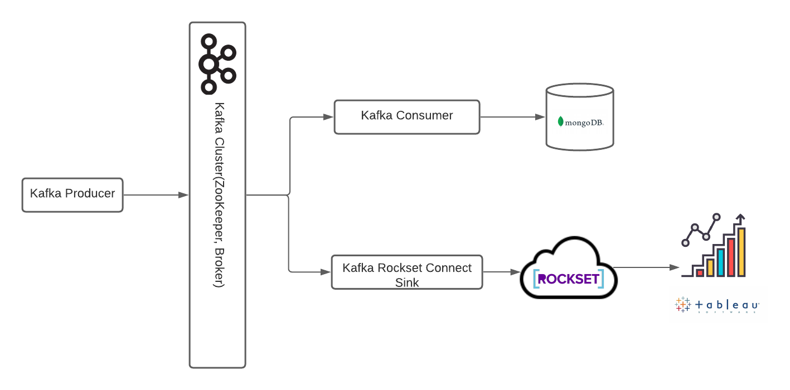
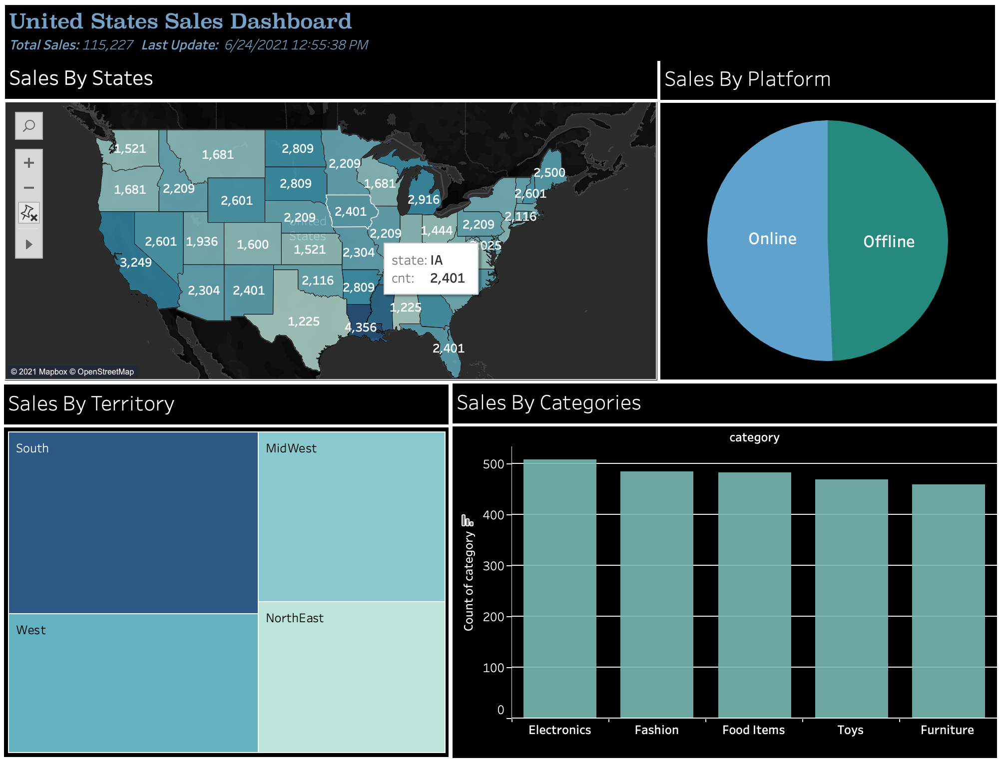

# LOW-LATENCY SALES BI DATA PIPELINE

## Overview

The data pipeline is designed to provide near real-time analysis of the sales for a fictional company. The project has following components:

- ### _Producer_
     - [kafkaProducer.py](kafkaProducer.py) file generates dummy sales data and streams it with topic 'sales'. The data contains information about three sales attributes: State, Category, Platform

- ### _Consumer_
    - [kafkaConsumer.py](kafkaConsumer.py) file consumes the stream by producer with topic 'sales' and writes the records to the collection 'salesRecords' in mongoDB.

- ### _Kafka Connect_
    - The connector is used to perform kafka integration with the Rockset Cluster.

- ### _Tableau_
    - With custom SQL the data from Rockset Cluster is queried and visualized. The dashboard [Sales_Dashboard](Sales_Dashboard.twb) contains the code for custom SQL and visualizations.

## Data Pipeline Flow

## Tableau Dashboard

The dashboard is published on Tableau Public and can be accessed by following this [link](https://public.tableau.com/app/profile/onkar.rane2814/viz/USSales_16245609903750/SalesDash)

